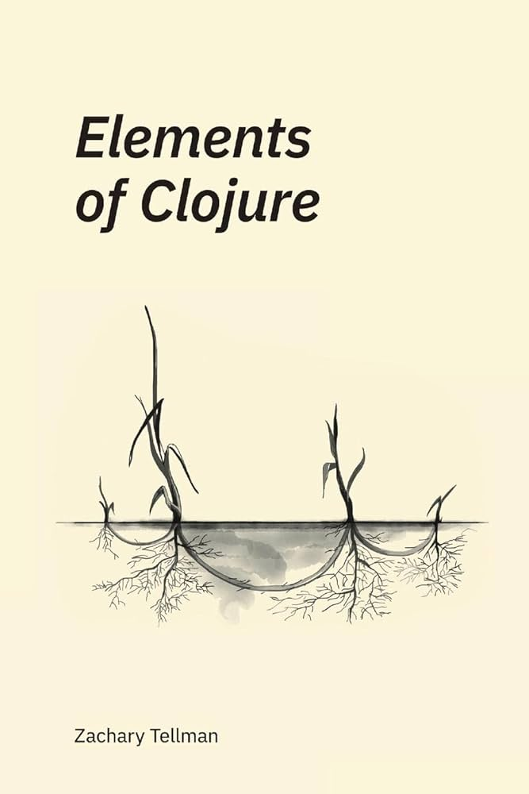

# Book of the Month

## Zachary Tellmann: Elements of Clojure

Despite its name, this book gives very general pointer for programming, including

 - how to name things
 - what abstraction and indirection have in common
 - how parts of programms work together

Message @zgtm for a PDF copy.

## Proposals for the next Book of the Month

Please propose new books in the [Github Wiki](https://github.com/CodeIntelligenceTesting/botm/wiki).
